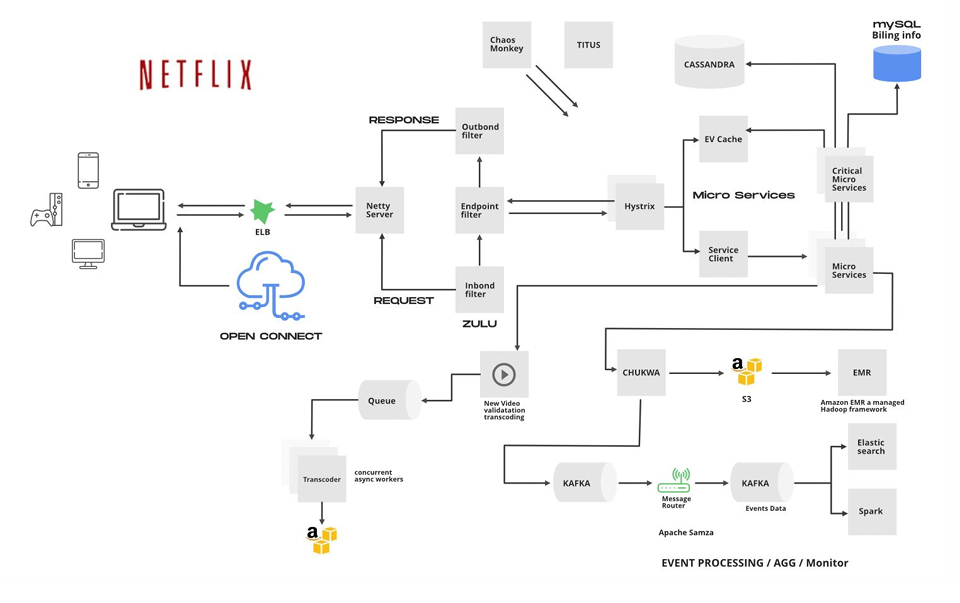

# SOFTWARE ENGINEERING LAB TASKS 

## Problem Statement – 1: 
Your new software project is a product delivery platform. As a part of project initiation and approval you are required to perform and note down a thorough competitor analysis. (Some companies with a product delivery platform are Unbxd, Algolia etc.)  

After your analysis, you are expected to do the following exercise as a part of risk management. 

On the digital document or paper, add columns with the following headers: 
* What could cause a miss in your deadline?
* What will keep your project on time?
* What does this project need that you don’t have?
* What do you already have that this project needs?
* What are you worried about?
* What are you excited about?
* What could go wrong with this project?
* What could go right with this project? 

Brainstorm and write down answers for these questions first. Next, mention the points that you feel are going to be risks and successes. 
(Hint: To identify successes, ask yourself this question – “What’s the opposite of this risk?”) 

## Problem Statement – 2: 
You are required to curate the AWS architecture for an Indian Premier League management system, complete with a score predictor and attractive dashboard. Explain why that particular service has been used and draw a final flowchart with all the services you think are necessary.

Your architecture diagram/flowchart should be similar to the picture shown below. 

Example: This is the final architecture diagram for Netflix

  

 

## Problem Statement – 3: 
Explore the MakeMyTrip website https://www.makemytrip.com/. 

Write the minispecs and draw the top level DFD, first level decomposition and second level composition for the MakeMyTrip website.
